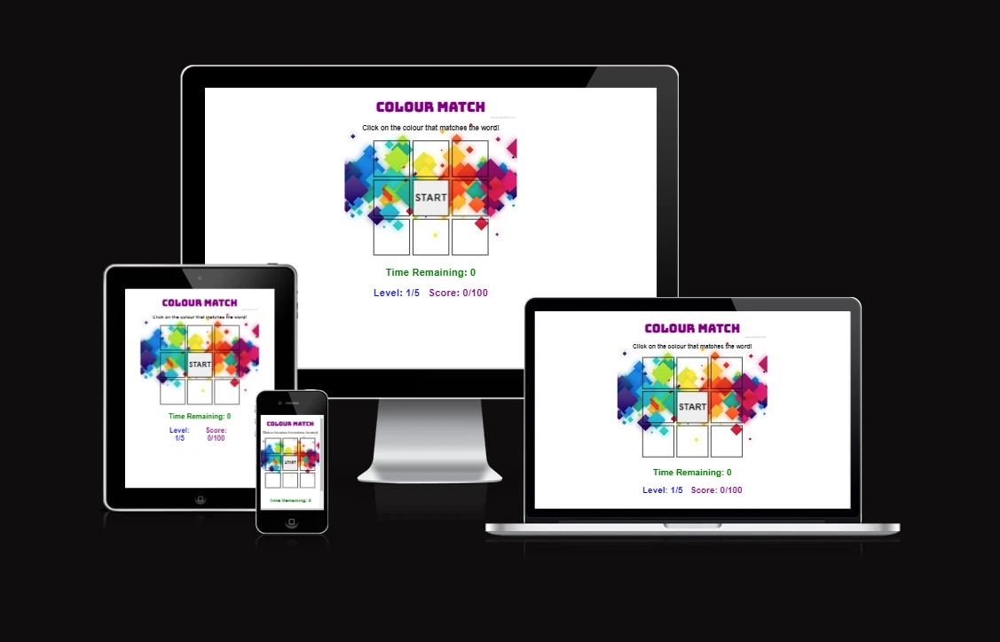

# Color Match Game

[View the live website here](https://danpug.github.io/Colour-Match-Game/)

 

## Table of Contents

1. [How to Play](#how-to-play)
2. [User Experience (UX)](#user-experience-ux)
3. [Wireframes](#wireframes)
4. [Features](#features)
5. [Technologies Used](#technologies-used)
6. [Testing](#testing)
7. [Deployment](#deployment)
8. [Credit](#credit)
9. [Acknowledgments](#acknowledgments)
10. [Future](#future)

 

## How to Play {#how-to-play}

1. Click the "Start" button to begin the game.
2. A colour name will appear in the center, displayed in a different colour to the name.
3. Click on one of the surrounding colour boxes that matches the NAME of the colour displayed in the centre box.
4. You have a limited amount of time to make your decision; if you run out of time or click the wrong colour box, the game will end.
5. Correctly match 20 colours in a row to move on to the next level. Each level decreases the amount of time you have to select a box.
6. Complete level 5 to win the game.

 

## User Experience (UX) {#user-experience-ux}

The game was designed to fit well on screens of all sizes. The design is compact and symmetrical and features 8 coloured boxes around the colour name. The reason for choosing 8 boxes was to get as many colours as possible and also keep them quickly in reach of each other so that they can be pressed quickly. As the game is based on colour, the background is kept white so that the coloured boxes stand out. A background image of a few coloured squares was added to make the game more eye-catching. There are 3 fonts used within the game, Arial is used as the standard font and is used for the tagline, timer, level and score. The tagline is kept in black so that it stands out best against the white background as this is the basic instruction on how to play the game. The timer, level and score are in different colour fonts to tie-in with the theme of the game. The game title is in Bungee-Inline font as this gives a bold but playful look. The 'game over' and 'congratulations' message are in Press-Start-2p font and are coloured red, this ensures they stand out and tie-in with the gaming nature of the website. The colour name has a black background to help the colour name stand out as it is harder to read on a white background.

- Design
	- Colour Scheme	
		- The game is based on colours so the website uses base colours of black and white, with text written in bold colours

	- Typography
		- Arial is used for most of the text with Bungee Inline used for the heading so that it is bold and stands out. Press Start 2P is used for the game over and congratulations message as this is a traditional gaming font. Sans-serif is used as a backup font in case for some reason the font doesn't get imported into the website properly.

	- Imagery
		- The background image continues the theme of coloured squares and keeps the majority of the screen white for contrast.

 

## Wireframes {#wireframes}

[Wireframe can be viewed here](assets/images/wireframes.webp)

 

## Features {#features}

- [Screenshot of new game](assets/images/new-game.webp) 
- [Screenshot of game over](assets/images/game-over.webp)

- Responsive on all device sizes
- 5 levels of game play with increasing difficulty
- 100 correct responses required to complete the game
- Visual timer, level display and level score
- Works with touchscreen and with a mouse

 

## Technologies Used {#technologies-used}

### Languages Used

- HTML
- CSS
- Javascript

### Frameworks, Libraries and Programs Used

- Google Fonts 
	- Google fonts were used to import the 'Bungee Inline' and 'Press Start 2P' fonts.
- JQuery
	- JQuery was used with Javascript.
- Git
	- Git was used for version control by utilizing the Gitpod terminal to commit to Git and push to GitHub.
- Github
	- GitHub is used to store the project's code after being pushed from Git.
- Balsamiq 
	- Balsamiq was used to create the wireframe during the design process.
- Free Convert 
	- Free Convert was used to optimise the images for the website by converting them into WEBP.

 

## Testing {#testing}

### Manual testing

| What was tested                  | What was expected         | What was the result | Comments                                                             |
| -------------------------------- | ------------------------- | ------------------- | -------------------------------------------------------------------- |
| Clicking on the start button     | Game to start             | Game starts         | The start button was initially above the game but this took up to    | 
|                                  |                           |                     | much of the screen as I wanted all information visible without the   | 
|                                  |                           |                     | need for scrolling. The button was then moved to the same location   |
|                                  |                           |                     | as the colour name box.                                              |
|                                  |                           |                     |                                                                      |
| Clicking on correct colour box   | Game to continue          | Game continues      | None                                                                 |
|                                  |                           |                     |                                                                      |
| Clicking on incorrect colour box | Game to end and 'Game     | Works as expected   | Initially the 'Game Over' message wasn't clearing down after each    |
|                                  | Over' message to display  |                     | game. I added a remove instruction to the start button event handler |
|                                  |                           |                     |                                                                      |
| Clicking on anything except a    | Nothing to happen         | Nothing happens     | None                                                                 |
| colour box during the game       |                           |                     |                                                                      |
|                                  |                           |                     |                                                                      |
| Correctly clicking 20 times      | Level to increase to '2'  | Works as expected   | The game was remembering the score from the previous game and adding |
|                                  | and score to reset to '0' |                     | it to the current game, causing the level to increase to early. To   |
|                                  |                           |                     | fix this I had to reset the current score to 0. This is done in the  |
|                                  |                           |                     | 'reset game' function.                                               |
|                                  |                           |                     |                                                                      |
| Correctly clicking 40 times      | Level to increase to '3'  | Works as expected   | As above                                                             |
|                                  | and score to reset to '0' |                     |                                                                      |
|                                  |                           |                     |                                                                      |
| Correctly clicking 60 times      | Level to increase to '4'  | Works as expected   | As above                                                             |
|                                  | and score to reset to '0' |                     |                                                                      |
|                                  |                           |                     |                                                                      |
| Correctly clicking 80 times      | Level to increase to '5'  | Works as expected   | As above                                                             |
|                                  | and score to reset to '0' |                     |                                                                      |
|                                  |                           |                     |                                                                      |
| Correctly clicking 100 times     | Game to end and display   | Works as expected   | Initially the game was not stopping at 100 correct answers. To fix   |
|                                  | 'Congratulations' message |                     | this I had to change the box event handler to check if the player    |
|                                  |                           |                     | was at level 6 , instead of at level 5 with 20 correct answers.      |

### Responsiveness

[Am I Resonsive Image](assets/images/am-i-responsive.webp)

 The website was viewed on a desktop, laptop, Samsung S20 mobile phone and Samsung S10 mobile phone. It was also viewed on a variety of devices by using the Chrome developer tools.

 ### Code validation

W3C Markup Validator, W3C Validator and JsHint were used to validate the code.

[W3C Markup Validator Results](assets/images/html-validation.webp)

[W3C CSS Validator Results](assets/images/css-validation.webp)

[JsHint Validation Results](assets/images/jshint-validation.webp)

### Further Testing

- The website was tested on Google Chrome, Microsoft Edge, Brave and Firefox browsers.
- Google Lighthouse was used for mobile and desktop testing:
    - [Desktop Lighthouse Results](assets/images/lighthouse-desktop-result.webp)
    - [Mobile Lighthouse Results](assets/images/lighthouse-mobile-result.webp)
- The website was viewed on a desktop, laptop, Samsung S20 mobile phone and Samsung S10 mobile phone. It was also viewed on a variety of devices by using the Chrome developer tools.
- Family members were asked to play the game on the website to point out any bugs and/or user experience issues.

### Known Bugs

Stylesheet needs to include 'disabled' in order for Google Lighthouse to give a performance score of 100 on mobile.

 

## Deployment {#deployment}

### GitHub Pages

The project was deployed to [GitHub](https://github.com/DanPug/Colour-Match-Game) pages using the following steps:

1. Log in to GitHub and locate the GitHUb repository.
2. At the top of the repository, locate the 'Settings' button on the menu.
3. Locate the 'Pages' tab on the left hand side menu.
4. Under 'Branch', click the dropdown called 'None' and select 'Main'.
5. Click 'Save'.
6. Refresh the page if it doesn't do it automatically and at the top of the page you will see 'Your site is live at https://...'.

### Forking the Repository

By forking the GitHub repository we make a copy of the original repository on our GitHub account to view and/or make changes without affecting the original repository by using the following steps:

Log in to GitHub and locate the GitHub repository.
At the top of the repository, locate the 'Fork' button.
You should now have a copy of the original repository in your GitHub account.

### Making a Local Clone

1. Log into GitHub and locate the GitHub repository.
2. Under the repository name, click 'Clone or download'.
3. To clone the repository using HTTPS, under 'Clone with HTTPS' copy the link.
4. Open Git Bash.
5. Change the current working directory to the location where you want the cloned directory to be made.
6. Type 'Git Clone' and the paste the URL you copied in step 3.
7. Press 'Enter', your local clone will be created.

 

## Credit {#credit}

### Code

The 'Fisher-Yates shuffle' was used within assignBoxColors function, this code was obtained from w3schools.

### Content

background image - wwww.psdgraphics.com

 

## Acknowledgments {#acknowledgments}

[Click the colour and not the word game - Similar game used for inspiration](https://s3.mirror.co.uk/click-the-colour-and-not-the-word/index.html)

Functions are written out with the help of:

 

 

## Future {#future}

The game could be added to in future in order to keep players coming back. Future ides include:
- option to swap the rules so you need to click on the colour not the name
- Additional levels could be added with:
    - shrinking squares
    - flashing squares
    - moving squares
- Additional colours can be added
- Sound can be added to improve the experience